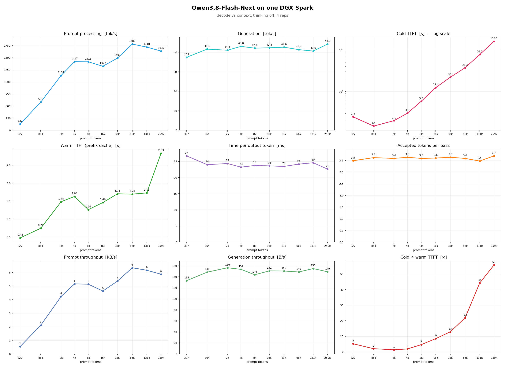

# Qwen3.8-Flash-Next on one DGX Spark (GB10)

By Paolo Rosson, [@redp314 on X](https://x.com/redp314), where the results and
follow-ups are posted first.

The 125B-total / 6B-active Flash-Next does not fit in 128 GB as published. This
is how it runs on a single Spark anyway, how fast, and the knobs that take it
from 33 tok/s to 52. The serving route is blazux's `qwen3.8-Flash-DGX` (the
official vLLM Flash-Next image plus a patch layer that memory-maps the 44 GiB
n-gram table from NVMe); this repository adds the tuned launch script, four
build overlays, the sweep harness, the measurements, and the fix for a boot
that was 2.5x slower than it needed to be.

| | Generation, 325 tokens to 259k | Real task, 4 coding/thinking | 8 streams (code) |
|---|---|---|---|
| `serve.sh` alone | **41-44 tok/s**, flat | 138 s | **218 tok/s** aggregate |
| plus `build/` overlays | **52 tok/s** mean, flat | **102 s** | not measured |

Both rows are this repository. The first is the launch script on the stock
image, which is what Quickstart gives you. The second adds the four overlays in
[`build/`](build/README.md) — a reduced draft head, a deterministic top-k
kernel, BF16 recurrent state, and staging the FP8 table read out of the forward
pass so full-decode CUDA graphs can capture. That last one is what makes the
rest possible.

Conditions: hybrid mode (fp8 side layers), MTP 3, `GPU_MEM=0.80`, temperature 0
(0.6 for the ladder), thinking off, decode only for the tok/s columns (time to
first token excluded), 4 reps per rung, one boot. The concurrency figure is
measured with [MiaAI-Lab/sparkDash](https://github.com/MiaAI-Lab/sparkDash),
not this repository's own scripts — see Concurrency below for why. The
`build/` row was measured with prefix caching off; decode rate is unaffected by
that flag (RESULTS.md §11), the task time is not. Everything else, with its
conditions, is in [RESULTS.md](RESULTS.md).



*The stock recipe, prefix caching on — what `serve.sh` gives you out of the box.
For the same nine panels on the tuned build see
`charts/ctxsweep-tunedv2-cacheon.png`, and for all three side by side,
`charts/threeway-comparison.png`.*

> **Update, 2026-09-09.** Two findings that change how to read the chart above.
>
> **Prefix caching is back on by default, and it matters more than any tuning
> here.** It was disabled on 2026-09-07 after `align` mode returned wrong-topic
> completions (RESULTS.md §8). That decision was validated against decode
> benchmarks, which send a fresh prompt every time and so cannot see what
> caching is for. Measured on the shape that actually failed — a shared prefix
> extended by new tokens each turn — 16 turns came back correct, and turn time
> went from tracking total context (~145 s at 241k) to a **flat ~18 s**. The
> root cause was never found, so this is "not reproduced", not "fixed":
> `bench/suffix_gate.py` is in here so you can check it against your own
> workload. Decode rate is unaffected either way, so every tok/s figure in this
> README still holds. [RESULTS.md §11](RESULTS.md).
>
> **The gains are not code-only.** Measured the same day: **+34.2% on
> thinking**, +31.7% on code, +27.6% on prose, with accepted tokens per pass
> unchanged — so the win is cheaper passes, not better guessing, which is why it
> survives on prose where guessing is weak. Real tasks: 138.3 s -> 96.8 s, or
> 63.7 s with caching on. The `build/` overlays reproduce the +22% arm of that;
> the strongest column adds four more overlays that are not in here yet. See
> [RESULTS.md §10](RESULTS.md) and `charts/threeway-comparison.png`.

## Requirements

| Item | Value | Source |
|---|---|---|
| Box | NVIDIA DGX Spark, GB10 Grace Blackwell, sm_121, aarch64, NVMe strongly recommended | the box |
| Memory | 128 GB LPDDR5X unified | vendor spec |
| Engine | [blazux/qwen3.8-Flash-DGX](https://github.com/blazux/qwen3.8-Flash-DGX): the official vLLM Flash-Next image plus the PLE-mmap patch layer | upstream repo |
| Checkpoint | `RadixArk/Qwen3.8-Flash-Next-NVFP4`, ~127 GB on disk, as published | checkpoint card |
| Memory in use | ~105 GB after load; 14-17 GB left. Nothing else large can run beside it | measured here |
| Boot | ~300 s with `FAST_LOAD=1` (experimental, see Traps), otherwise 8-13 min | measured here |
| Context | 262,144 tokens native; up to ~500,000 with YaRN (`YARN=1`, validated) | checkpoint config, measured here |
| Docker + NVIDIA Container Toolkit | required (`docker run --gpus all`) | measured the hard way |

**Weights are not included** and carry Qwen's own licence.

## Weights

The server runs with `HF_HUB_OFFLINE=1` and never downloads anything. Put the
checkpoint in the cache `serve.sh` mounts (`HF_CACHE`, default
`~/.cache/huggingface`, which must contain a `hub/` directory in the standard
Hugging Face layout):

```bash
pip install -U huggingface_hub          # gives the `hf` CLI (older installs call it huggingface-cli)
export HF_HOME=$HOME/.cache/huggingface
hf download RadixArk/Qwen3.8-Flash-Next-NVFP4 --revision 7b719225242aacd3dbd3f9407468c2ee9a9d2594
```

That is the snapshot every number here was measured on. `.env.sample` exports
it as `SNAPSHOT_SHA`; pass it to `serve.sh` as `REVISION` to pin it explicitly
rather than let the script pick whatever single snapshot happens to be on disk
(see Traps).

`serve.sh` checks two things a successfully-downloaded checkpoint does not
prove before it spends 8-13 minutes booting: that the snapshot it resolved
actually holds `.safetensors` files (a partial download does not), and, if
`REVISION` is set, that the requested snapshot exists at all. Both fail
instantly with a clear message instead of a slow, confusing boot.

## Quickstart

```bash
git clone https://github.com/blazux/qwen3.8-Flash-DGX.git && cd qwen3.8-Flash-DGX
docker build -t qwen38-flash-dgx .                    # pulls the pinned base, ~1 min on top

# Drop this repository's launch script and loader patch in, overwriting the stock ones:
cp /path/to/qwen3.8-flash-next-dgx-spark/serve.sh scripts/serve.sh
mkdir -p scripts/scripts && cp /path/to/qwen3.8-flash-next-dgx-spark/scripts/weight_utils.nogds.py scripts/

scripts/download-weights.sh --revision 7b719225242aacd3dbd3f9407468c2ee9a9d2594   # ~127 GB
scripts/prepare-hybrid.sh                             # one-time, ~10 min: side layers to blockwise fp8
MODE=hybrid MTP=3 GPU_MEM=0.80 PORT=18300 scripts/serve.sh
docker logs -f qwen38-flash                           # wait for "Application startup complete"

curl -s http://localhost:18300/v1/chat/completions -H 'Content-Type: application/json' \
  -d '{"model":"qwen3.8-flash-next","max_tokens":64,"chat_template_kwargs":{"enable_thinking":false},
       "messages":[{"role":"user","content":"Write a haiku about GPUs."}]}'

./stop.sh   # when done; the restart policy needs an explicit stop
```

Stop any other large model first. A 27B recipe and this one do not share 128 GB.

## What you get, and under what conditions

**Generation across the context ladder.** `bench/ctxsweep.py`, hybrid mode,
MTP 3, temperature 0, thinking off. Five of the ten rungs measured; all ten are
in RESULTS.md §1.

| Prompt tok | Prefill tok/s | Gen tok/s | Accepted tok/pass | Cold TTFT |
|---|---:|---:|---:|---:|
| 327 | 132 | 37.4 | 3.49 | 2.5 s |
| 4,292 | 1,417 | 43.0 | 3.64 | 3.0 s |
| 32,850 | 1,491 | 42.6 | 3.64 | 22.0 s |
| 131,437 | 1,718 | 40.6 | 3.47 | 76.5 s |
| 258,790 | 1,637 | 44.2 | 3.69 | 158.1 s |

Generation holds 37-44 tok/s from 327 tokens to 258,790 — flat, not falling,
because only a fraction of the model's layers pay for context depth; the rest
carry constant-size recurrent/gated state. Cold TTFT scales with prompt size as
expected; warm (prefix-cache-hit) TTFT stays under 3 s even at the top rung
(RESULTS.md §1).

**The tuning knobs, on the original sweep (2026-09-02, MTP 2 baseline):**

| Prompt tokens | As published, MTP 2 | Hybrid, MTP 2 | **Hybrid, MTP 3** | Hybrid, MTP 4 |
|---|---|---|---|---|
| 324 | 33.5 (2.81) | 36.8 (2.90) | **42.2** (3.62) | 41.7 (4.36) |
| 8k | 34.3 (2.91) | 39.9 (2.88) | **44.3** (3.65) | 41.3 (4.27) |
| 33k | 33.7 (2.86) | 40.7 (2.89) | **45.2** (3.68) | 47.1 (4.46) |
| 65k | 33.6 (2.80) | 39.0 (2.76) | **46.0** (3.71) | 44.1 (4.23) |
| 130k | 33.9 (2.82) | 39.1 (2.80) | **46.1** (3.70) | 42.8 (4.12) |
| 260k | 33.9 (2.86) | 40.6 (2.85) | **42.6** (3.49) | 44.2 (4.35) |

Generation tok/s, accepted tokens per pass in brackets. 512 output tokens, 2
reps, one boot per column.

- **Hybrid mode is +10-20%**: the dense side layers, read in full every token,
  rewritten as fp8. Acceptance unchanged. It is bytes, not compute.
- **MTP 3 is +12-15% on top of MTP 2**, because the MTP head was 93-97%
  saturated at budget 2. **MTP 4 gives nothing more**: each extra position is
  another forward through the same head, and the two effects cancel.
- **`EXACT_TOPK=0`** (the stock sparse-attention kernel) is +17-24% prefill
  with generation unchanged, at the cost of non-deterministic output. Not in
  the recommended launch.

## Concurrency

**Measured with [sparkDash](https://github.com/MiaAI-Lab/sparkDash)
(MiaAI-Lab), not this repository's own scripts.** `bench/concbench.py`
(inherited from a companion recipe for a different engine) gives numbers on
this server that disagree with sparkDash by roughly 4x at the same nominal
concurrency, and I have not found the cause — see Traps. Until that is
resolved, the concurrency claim below is sparkDash's, credited as the
instrument, not reproduced by anything in `bench/`.

sparkDash's DecodeBench, 2048-token target, temperature 0, thinking off, 8
seats:

| Streams | 1 | 2 | 4 | 6 | 8 |
|---|---|---|---|---|---|
| Code, aggregate tok/s | 45.4 | 82.2 | 131.9 | 171.6 | **218.3** |
| Code, per stream tok/s | 45.4 | 41.2 | 33.3 | 28.8 | 27.6 |
| Structured, aggregate tok/s | 45.5 | 82.9 | 131.5 | 173.3 | 209.6 |

Full tables, including prose and the 256-token setting, are in RESULTS.md §2.

## Reproducing these numbers

`bench/` needs only the standard library plus matplotlib for the charts
(`pip install -r bench/requirements.txt`). The sweep scripts write one jsonl per
run into `results/`, which is git-ignored.

```bash
cp .env.sample .env && source .env   # SPARK_BASE_URL, SPARK_MODEL, SNAPSHOT_SHA
python3 bench/ctxsweep.py --base "$SPARK_BASE_URL" --model "$SPARK_MODEL" \
        --label recommended --out-tokens 512 --reps 4
python3 bench/plotsweep.py results/ctxsweep-recommended-*.jsonl \
        --out charts/ctxsweep-flashnext-thinking-off.png \
        --title "Qwen3.8-Flash-Next on one DGX Spark" --subtitle "decode vs context, thinking off"
```

The sweep's ceiling rung pays a ~160 s cold prefill before a single token comes
out, once per repeat. `bench/plotsweep.py` rebuilds the chart from the jsonl it
is given; a chart that cannot be rebuilt that way does not ship.

Before trusting prefix caching on your own workload, run both gates. They print
what they check and exit non-zero on any corruption:

```bash
python3 bench/cache_gate.py  "$SPARK_BASE_URL" "$SPARK_MODEL"          # repeat + interleave
python3 bench/suffix_gate.py "$SPARK_BASE_URL" "$SPARK_MODEL" 60000 15000 8
```

The second is the one that matters: it grows a shared prefix by new tokens each
turn, which is what an agent does and what failed here on 2026-09-07.

## Thinking and tool calling

The recommended launch starts with `--reasoning-parser qwen3`,
`--tool-call-parser qwen3_coder`, and thinking is controlled per request via
`chat_template_kwargs`. Every number in this repository is thinking **off**
(`{"enable_thinking": false}`). Turning it on is a heavier workload, not a
slower server: expect lower accepted tokens per pass and more output tokens.
Tool calls come back in the OpenAI `tool_calls` shape.

## Using the API

OpenAI-compatible on `:18300`, no API key by default.

```bash
curl -s http://localhost:18300/v1/chat/completions -H 'Content-Type: application/json' \
  -d '{"model":"qwen3.8-flash-next","messages":[{"role":"user","content":"Refactor this function: ..."}],
       "max_tokens":512,"temperature":0,"chat_template_kwargs":{"enable_thinking":false},
       "stream":true,"stream_options":{"include_usage":true}}'
```

**`usage.prompt_tokens_details` is always `null` on this vLLM build**
(`0.1.dev20073+g8e685d198`), not zero — the field is simply unpopulated. Any
client that reads it for a cache-hit count (opencode's context panel does)
will always show 0 regardless of real caching. Real prefix-cache activity only
shows up in this server's own `/metrics`
(`vllm:prefix_cache_hits_total` / `_queries_total`), never in the per-request
response.

## Logs and troubleshooting

- `docker logs -f qwen38-flash`: boot is 8-13 minutes (~300 s with
  `FAST_LOAD=1`); wait for "Application startup complete".
- `docker inspect --format '{{.RestartCount}}' qwen38-flash` should be 0. A
  green `/v1/models` can answer before the scheduler is actually live; a
  `/v1/chat/completions` call that hangs or 500s while `/v1/models` is green
  means the container is still starting.
- Metrics are on `:18300/metrics`; `vllm:spec_decode_num_accepted_tokens_total`
  and `_num_drafts_total` are the counters `bench/ctxsweep.py` uses for
  accepted tokens per pass.
- `Input length ... exceeds the maximum allowed length` is the context window,
  not the KV pool; lower the prompt or raise `CTX` (native ceiling 262,144).

## Traps

The ones a replicator can hit.

- **`serve.sh` picks an arbitrary snapshot if more than one exists and
  `REVISION` is unset.** It warns when this happens, but a silent pick is how a
  number stops being reproducible. Pin `REVISION` to the SHA under Weights.
- **`FAST_LOAD=1` OOM-killed the container twice in five boots (2026-09-05)**
  before a fix: `fastsafetensors` moves whole files to the device, so the load
  pass for the MTP draft (three small bf16 shards) was re-streaming the entire
  ~76 GiB checkpoint through device staging on top of what was already loaded.
  `scripts/weight_utils.nogds.py` restricts that second pass to its own three
  files. The fix is deployed and matches the mechanism, but has not yet been
  proven clean over many boots — treat `FAST_LOAD=1` as experimental until it
  has. Default is off.
- **GB10's unified memory does not reclaim clean page cache for `cudaMalloc`.**
  After serving for a while, the 47.7 GiB mmapped PLE table sits in page cache;
  a *second* fast boot can then fail allocating device memory with `MemFree`
  reading under 1 GiB even though the machine looks idle. `FAST_LOAD=1` evicts
  every large file's pages with `fadvise DONTNEED` before loading, for exactly
  this reason.
- **`bench/concbench.py`'s Flash-Next numbers do not match sparkDash's**, by
  roughly 4x aggregate at the same nominal concurrency, on the same server, the
  same night. The metric-reading code is engine-aware (it was checked, not
  assumed) so this is not an SGLang/vLLM name mismatch; the actual cause is
  unresolved. Its numbers are not published here — see Concurrency.
- **Prefix caching forces vLLM's Mamba cache into `align` mode for this model**
  (`config.py:605`), and `--mamba-cache-mode none`/`all` cannot override it —
  vLLM silently reverts both. On 2026-09-07 that mode returned completions
  ignoring the prompt. It has not reproduced since across 16 growing-suffix
  turns and five gate rounds on two images, and the default is `PREFIX_CACHE=1`
  again, but the cause was never found. Run `bench/suffix_gate.py` on your own
  workload before depending on exact output.
- **`GPU_MEM` above 0.80 leaves too little page cache for the mmapped table**
  and the box drifts toward swap over a long-running day (documented upstream).
- Prepare the hybrid checkpoint with the server stopped; the conversion needs
  memory the running model is holding.
- Prompt plus output must fit 262,144 tokens (native) or the request is
  refused with HTTP 400.

## Set it up with an agent

`AGENT_SETUP.md` is a self-contained prompt. Paste it into a coding agent with
shell access on the Spark (Claude Code, Codex, opencode, or similar) and it
will clone the upstream engine, drop this recipe's launch script in, download
the weights, prepare the hybrid checkpoint, launch, verify, and run one rung of
the sweep, reporting each step. It never prints an API key.

## What's in here

```
serve.sh                        launch the server, hardened     every knob above
stop.sh                         stop it (restart policy needs an explicit stop)
.env.sample                     SPARK_* variables and the pinned snapshot SHA
scripts/weight_utils.nogds.py   FAST_LOAD's patched vLLM loader see Traps, scripts/NOTICE.md
bench/ctxsweep.py               context ladder, the headline instrument
                                                            --lengths --reps --temperature
bench/plotsweep.py              rebuild the ladder chart    positional jsonl files, --out
bench/cache_gate.py             prefix-caching gate: repeat, interleave, on-topic     §11
bench/suffix_gate.py            prefix-caching gate on the shape that actually failed:
                                shared prefix + growing suffix, the agent pattern   §11
data/ctxsweep-*.csv/.jsonl      the sweeps behind every table above
data/ctxsweep-{code,prose,thinking}-*-20260909.jsonl
                                the three-recipe comparison by output type         §10
data/replay-*-20260909.jsonl    real task wall time, four frozen tasks             §10, §11
charts/*.png                    regenerated from data/ by bench/plotsweep.py
charts/threeway-comparison.png  published vs tuned vs tuned v2                     §10
charts/ctxsweep-tunedv2-cacheon.png
                                tuned v2 with caching on, same panels as the top   §11
build/build.sh                  rebuild the tuned image: 4 overlays on the stock one
build/README.md                 what each overlay does, and why it fails loudly    §10
build/01-draft-vocab/           reduced MTP draft head (independent implementation)
build/02-det-topk/              deterministic QSA top-k CUDA extension (vendored)
build/03-staged-ple/            stages the FP8 PLE read out of forward() - this is
                                what makes FULL_DECODE_ONLY graphs capturable
build/04-gdn-flashinfer/        FlashInfer GDN backend on sm121
RESULTS.md                      every table, with its conditions, and the measuring lessons
AGENT_SETUP.md                  paste into a coding agent on the Spark to do the whole setup
```

## Limitations

- **One box, mostly one boot per configuration.** RESULTS.md notes where a
  rung was checked twice and where it was not.
- **No self-contained concurrency reproduction ships here.** See Traps: the
  inherited `concbench.py` disagrees with sparkDash by too much to trust
  either without more work, so the concurrency claim in this README is
  sparkDash's, cited as an external measurement.
- **Quality is not measured.** The frozen task replay checks that each task
  completes its token budget and returns a stable output hash; that is a
  functional check, not a quality benchmark. No task benchmark has been run
  against any of these recipes. The `build/` overlays set BF16 recurrent state,
  which **changes generation hashes** against the stock recipe — a precision
  change, not a lossless one.
- **The prefix-caching correctness story is incomplete.** The 2026-09-07
  failure's root cause was never found. Sixteen turns on the failing pattern
  plus five `cache_gate.py` rounds across two images found no corruption, but
  that is "not reproduced", not "fixed", and it is not a soak. Run
  `bench/suffix_gate.py` against your own workload rather than taking the
  default on trust.
- **`FAST_LOAD` is experimental**, not the default, with a fix deployed but not
  yet proven across many boots.
- **Weights are not included** and carry Qwen's own licence.
- This repository does not build an engine image from scratch. `serve.sh`
  patches [blazux/qwen3.8-Flash-DGX](https://github.com/blazux/qwen3.8-Flash-DGX)
  in place, and `build/` layers four overlays on top of that image. It is not
  tracking that repo's main branch, and every overlay is SHA-pinned to the
  file versions it was measured against.

## Credits

[blazux](https://github.com/blazux) for `qwen3.8-Flash-DGX`, the route that
makes this fit. RadixArk for the NVFP4 checkpoint.
[MiaAI-Lab](https://github.com/MiaAI-Lab) for sparkDash, the concurrency
instrument, and for the reduced-draft-vocabulary technique that
`build/01-draft-vocab` implements. Jürgen Schmied for the deterministic top-k
kernel vendored in `build/02-det-topk`. The FR-Spec paper for the idea behind
the reduced draft head. The vLLM and Qwen teams — including for
`use_local_argmax_reduction`, the hook the draft-vocabulary overlay is built on.

## License

MIT, see [LICENSE](LICENSE). Model weights are not covered by it.

Questions and results from your own box: [@redp314](https://x.com/redp314).
