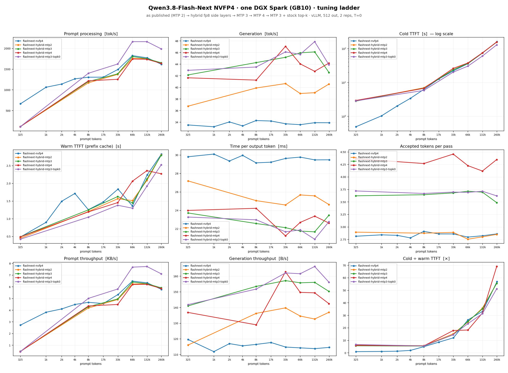

# Qwen3.8-Flash-Next on one DGX Spark (GB10)

By Paolo Rosson, [@redp314 on X](https://x.com/redp314).

The 125B-total / 6B-active Flash-Next does not fit in 128 GB as published. This
is how it runs on a single Spark anyway, how fast, and the two knobs that take it
from 33 to 45 tok/s. The serving route is blazux's `qwen3.8-Flash-DGX` (the
official vLLM Flash-Next image plus a patch layer that memory-maps the 44 GiB
n-gram table from NVMe); this repository adds the measurements, the tuned
launch, and the sweep harness.

| Generation, 325 tokens to 260k | Prefill past 8k | Cold first token at 260k |
|---|---|---|
| **42-46 tok/s, flat** | 1,200-1,800 tok/s | 155 s |

Conditions: hybrid mode (fp8 side layers), MTP 3, exact top-k, `GPU_MEM=0.80`,
512 output tokens, temperature 0, median of 2 reps per rung, one boot each.



## Requirements

| Item | Value |
|---|---|
| Box | NVIDIA DGX Spark, GB10, 128 GB unified, NVMe strongly recommended |
| Checkpoint | `RadixArk/Qwen3.8-Flash-Next-NVFP4`, ~127 GB on disk, as published |
| Engine | `blazux/qwen3.8-Flash-DGX` (vLLM image pinned by digest, one-minute build) |
| Memory in use | ~105 GB after load; 14-17 GB left. Nothing else large can run beside it |
| Boot | 16 minutes to "Application startup complete" |

Weights are not included and carry Qwen's licence.

## Quickstart

```bash
git clone https://github.com/blazux/qwen3.8-Flash-DGX.git && cd qwen3.8-Flash-DGX
docker build -t qwen38-flash-dgx .            # pulls the pinned base, ~22 GB
scripts/download-weights.sh                   # or point HF_CACHE at an existing cache
scripts/prepare-hybrid.sh                     # one-time, ~10 min: side layers to blockwise fp8
MODE=hybrid MTP=3 GPU_MEM=0.80 PORT=18300 scripts/serve.sh
docker logs -f qwen38-flash                   # wait for "Application startup complete"
```

Stop any other large model first. Our 27B server had to come down; the two do
not share 128 GB.

## What you get

Same sweep as the 27B recipe (`bench/ctxsweep.py`, which reads vLLM's
speculative-decoding counters), 512 output tokens, temperature 0, 2 reps.
Generation tok/s, with accepted tokens per pass in brackets.

| Prompt tokens | As published, MTP 2 | Hybrid, MTP 2 | **Hybrid, MTP 3** | Hybrid, MTP 4 |
|---|---|---|---|---|
| 324 | 33.5 (2.81) | 36.8 (2.90) | **42.2** (3.62) | 41.7 (4.36) |
| 8k | 34.3 (2.91) | 39.9 (2.88) | **44.3** (3.65) | 41.3 (4.27) |
| 33k | 33.7 (2.86) | 40.7 (2.89) | **45.2** (3.68) | 47.1 (4.46) |
| 65k | 33.6 (2.80) | 39.0 (2.76) | **46.0** (3.71) | 44.1 (4.23) |
| 130k | 33.9 (2.82) | 39.1 (2.80) | **46.1** (3.70) | 42.8 (4.12) |
| 260k | 33.9 (2.86) | 40.6 (2.85) | **42.6** (3.49) | 44.2 (4.35) |

- **Generation is flat to the ceiling.** 6B active parameters through Gated
  DeltaNet and sparse attention: the per-token cost barely sees the context.
- **Hybrid mode is +10-20%**: the dense side layers, read in full every token,
  rewritten as fp8. Acceptance unchanged. It is bytes.
- **MTP 3 is +12-15% on top**, because the MTP head was 93-97% saturated at
  budget 2. **MTP 4 gives nothing more**: each extra position is another forward
  through the same head, and the two cancel.
- **`EXACT_TOPK=0`** (the stock sparse-attention kernel) is +17-24% prefill with
  generation unchanged, at the cost of non-deterministic output. Not in the
  recommended launch.
- Prefill rises with depth, 664 tok/s at 325 tokens to ~1,800 at 65k, and holds
  ~1,650 at 260k. The small-prompt figure is the n-gram table's page cache being
  cold after a boot; it warms within the sweep.
- Warm time to first token is 0.5-2.8 s (prefix cache plus the exact top-k pass
  on the appended tokens).

First light, before tuning: coherent and deterministic on the repo's smoke test,
1,168 tok/s prefill on a 10.7k prompt, prefix-cache hit in 1.45 s, 24-30 tok/s on
256-token code answers.

## Reproducing

```bash
export SPARK_BASE_URL=http://localhost:18300/v1 SPARK_MODEL=qwen3.8-flash-next SPARK_API_KEY=""
python3 bench/ctxsweep.py --label flashnext --reps 2 --out-tokens 512
python3 bench/plotx.py data/ctxsweep-flashnext.csv --panels compare --out charts/flashnext-ladder.png
```

`data/ctxsweep-flashnext.csv` holds every rung of every configuration above.

## Traps

- Prompt plus output must fit 262,144 tokens or the request is refused with 400;
  the sweep caps its top rung.
- `GPU_MEM` above 0.80 leaves too little page cache for the mmapped table and
  the box drifts into swap over a day (the upstream repo documents this).
- Prepare the hybrid checkpoint with the server stopped; the conversion needs
  memory the running model is holding.
- The docstring warnings about `min_frames`/`max_frames` at boot are harmless.

## Credits

blazux for `qwen3.8-Flash-DGX`, the route that makes this fit; RadixArk for the
NVFP4 checkpoint; the vLLM and Qwen teams.

## License

MIT, see [LICENSE](LICENSE). Model weights are not covered by it.
